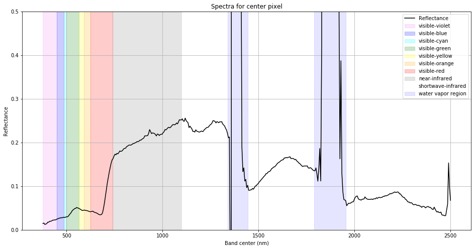

# Python: Basic processing of hyperspectral imagery from AVIRIS-NG collected during ABoVE airborne campaigns

*Date: February 19, 2019*  
*Contact for ORNL DAAC: uso@daac.ornl.gov*  

### Keywords: AVIRIS-NG, Arctic Boreal Vulnerability Experiment, ABoVE

## Overview

The tutorial outlined in the [jupyter notebook](above-airborne-avirisng-python.ipynb) will outline a number of methods for manipulating hyperspectral imagery efficiently in Python.

Read more about the Arctic Boreal Vulnerability Experiment:                    
https://above.nasa.gov/       
https://daac.ornl.gov/cgi-bin/dataset_lister.pl?p=34               

*Figure. Spectral curve extracted for the center pixel of the reflectance granule using in the jupyter notebook.*

## Dataset

**ABoVE: Hyperspectral Imagery from AVIRIS-NG for Alaskan and Canadian Arctic, 2017**

**DOI**        
[10.3334/ORNLDAAC/1569](https://doi.org/10.3334/ORNLDAAC/1569)  

**Abstract**     

This dataset provides Level 1 radiance and Level 2 surface reflectance measured by the Airborne Visible/Infrared Imaging Spectrometer-Next Generation (AVIRIS-NG) instrument during flights over the Arctic-Boreal Vulnerability Experiment (ABoVE) domain between June and August 2017. AVIRIS-NG measures reflected radiance at 5-nanometer (nm) intervals in the visible to shortwave infrared spectral range between 380 and 2510 nm. Measurements are radiometrically and geometrically calibrated and provided at approximately 5-meter spatial resolution. The data include 422 flight lines covering areas of interest to the ABoVE campaign over much of Alaska and western Canada. These data will allow researchers to characterize ecosystem structure and function near the height of the growing season. This dataset represents one part of a multisensor airborne sampling campaign conducted by eleven different aircraft teams for ABoVE.

Please see the [**User Guide**](https://daac.ornl.gov/ABOVE/guides/ABoVE_Airborne_AVIRIS_NG.html) for a comprehensive description of this dataset.
        
**Citation**     

Miller, C.E., R.O. Green, D.R. Thompson, A.K. Thorpe, M. Eastwood, I.B. Mccubbin, W. Olson-duvall, M. Bernas, C.M. Sarture, S. Nolte, L.M. Rios, M.A. Hernandez, B.D. Bue, and S.R. Lundeen. 2018. ABoVE: Hyperspectral Imagery from AVIRIS-NG for Alaskan and Canadian Arctic, 2017. ORNL DAAC, Oak Ridge, Tennessee, USA. https://doi.org/10.3334/ORNLDAAC/1569

## Prerequisites           
 
**Python 3.x**: tarfile, gdal, numpy, pandas, matplotlib
 
Each flight line in this dataset has two corresponding granules each stored in a zipped archive:            
* level 1 radiance, e.g. ang20170624t185017.tar.gz            
* level 2 reflectance, e.g. ang20170624t185017rfl.tar.gz     

In this tutorial, you will learn how to read/write data from one of the level 2 files in Python. [Click here](https://daac.ornl.gov/daacdata/above/ABoVE_Airborne_AVIRIS_NG/data/ang20170624t185017rfl.tar.gz) to download the example granule.

## Procedure

Access the the tutorial here:  
[Tutorial](above-airborne-avirisng-python.ipynb)
